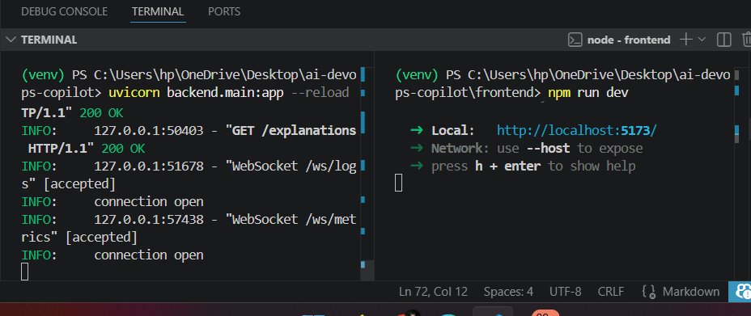
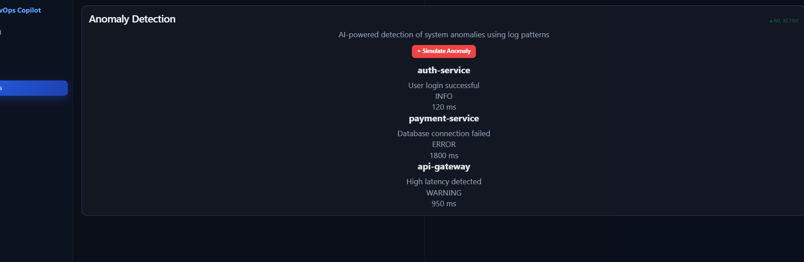
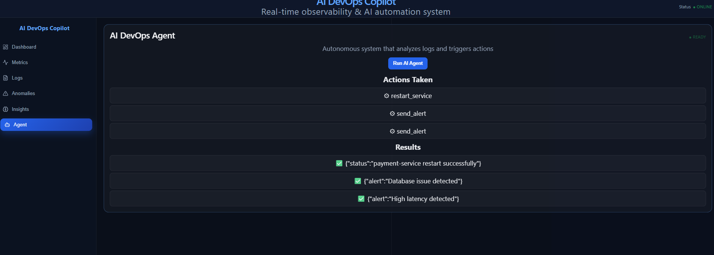
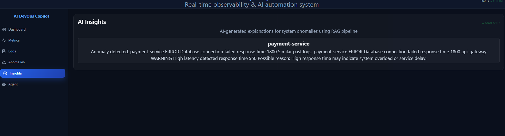

# 🚀 AI DevOps Copilot

A full-stack **AI-powered DevOps observability platform** that provides real-time monitoring, log streaming, anomaly detection, and AI-driven insights through a modern web dashboard.

---

## 🎯 Problem Statement

Modern DevOps systems generate massive logs, metrics, and alerts that are hard to interpret manually.

This project solves that by combining:
- Observability (logs + metrics)
- AI-driven anomaly detection
- Real-time system monitoring
- Automated agent decision-making

into a single unified dashboard.

---

## ✨ Features

### ⚙️ Backend (FastAPI)
- REST APIs for logs, metrics, anomalies
- WebSocket-based real-time streaming
- Live system metrics monitoring
- Log processing engine
- Anomaly detection system
- AI agent decision module
- RAG-style explanation system

---

### 🌐 Frontend (React Dashboard)
- Full-screen SaaS-style dashboard
- Real-time metrics visualization (Recharts)
- Live log streaming panel
- Anomaly detection panel
- AI insights / explanations panel
- Agent execution panel
- Clean modular UI architecture

---

## ⚙️ How It Works

1. Backend collects logs and system metrics
2. Data is streamed via WebSockets
3. Frontend receives real-time updates
4. Anomaly detection processes incoming data
5. AI agent decides actions based on anomalies
6. UI updates dynamically in real time

---

## 🧠 Key System Design Decisions

- WebSockets for real-time communication
- Modular backend architecture (services-based)
- Separation of logs, metrics, AI, and agent layers
- Stateless React frontend dashboard
- Scalable API-first design
- Event-driven architecture for live updates

---

## 🚀 What Makes This Project Unique

- Combines DevOps + AI + Observability in one system
- Real-time streaming dashboard (Datadog-like UI)
- AI-powered anomaly interpretation layer
- Extensible modular architecture
- Built for scalability and production-like structure

---

## 🧱 Tech Stack

### Frontend
- React (Vite)
- Recharts
- WebSockets
- HTML / CSS / JavaScript

### Backend
- Python
- FastAPI
- Uvicorn
- AsyncIO

### System Design
- REST APIs
- WebSockets
- Event-driven architecture

---

## 📁 Project Structure

```text
ai-devops-copilot/
│
├── backend/
│   ├── main.py
│   ├── services/
│   ├── mcp_server/
│   ├── llm_agent.py
│
├── frontend/
│   ├── src/
│   │   ├── components/
│   │   │   ├── dashboard/
│   │   │   ├── metrics/
│   │   │   ├── logs/
│   │   │   ├── anomalies/
│   │   │   ├── agent/
│   │   │   ├── explanations/
│   │   │   ├── layout/
│
├── screenshots/
│   ├── home.png
│   ├── metrics.png
│   ├── logs.png
│   ├── anomaly.png
│   ├── agent.png
│
├── README.md


## 📸 Screenshots


### 📊 Live Metrics Dashboard
Real-time CPU, Memory, Disk monitoring




### 📊 Live Metrics Dashboard
Real-time CPU, Memory, Disk monitoring


---

### 📜 Logs Streaming Panel
Live system logs with severity tracking


---

### ⚠️ Anomaly Detection Panel
AI-detected system anomalies




### 🤖 AI Agent Panel
Automated decision-making system




### 🤖 AI explanation Panel
explanation 


🔮 Future Improvements
Integrate LLM-powered intelligent agent (GPT-based)
Add Docker + Kubernetes deployment
Cloud deployment (AWS / Render / Vercel)
Add authentication & user roles
Add alerting system (Slack / Email integration)
Advanced analytics dashboard (Grafana-style)
👨‍💻 Author

Udhav 